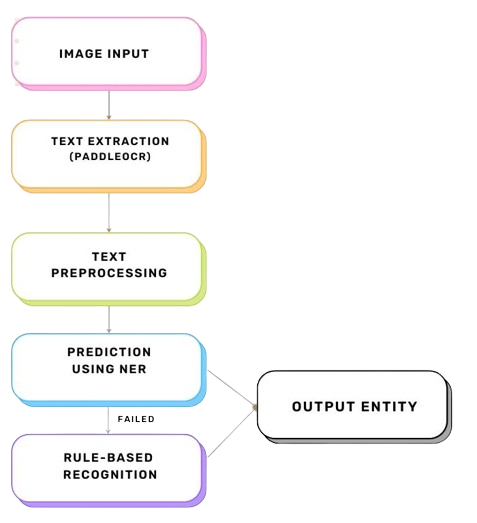
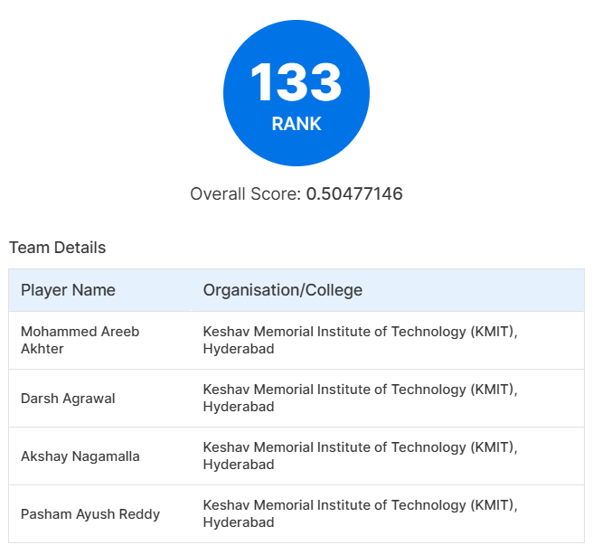

#  Amazon ML Challenge 2024

## Entity Value Extraction

In this hackathon, our goal is to develop a machine learning model that can extract entity values (such as weight, dimensions, etc.) directly from product images. This is especially useful in fields like healthcare, e-commerce, and content moderation, where accurate product information is crucial for digital stores.

## **Data Description**

The dataset consists of the following columns:

- **index**: A unique identifier (ID) for the data sample.
- **image_link**: Public URL where the product image is available for download. Example link - [https://m.media-amazon.com/images/I/71XfHPR36-L.jpg](https://m.media-amazon.com/images/I/71XfHPR36-L.jpg). To download images, use the `download_images` function from `src/utils.py`. See sample code in `src/test.ipynb`.
- **group_id**: Category code of the product.
- **entity_name**: Product entity name. For example, “**item_weight**”.
- **entity_value**: Product entity value. For example, “**34 gram**”.

### ⚙️ Approach Overview

---

1. **🔍 Text Extraction using PaddleOCR**:

   - We use **PaddleOCR** to extract text from the images.
   - This tool helps retrieve essential textual information from images accurately.

2. **🧹 Text Preprocessing**:

   - After extraction, the text is cleaned and preprocessed.
   - We remove any irrelevant characters and inconsistencies to make it easier to recognize entities.

3. **📑 Named Entity Recognition (NER)**:

   - A custom-trained **NER model** is used to identify key entity values such as weight, voltage, and dimensions.
   - The model predicts both the `entity_value` and the corresponding `entity_name` by locating their start and end indices.

4. **🧮 Rule-based Recognition**:

   - If the NER model fails, we fall back to **Rule-based Recognition**.
   - This uses **regular expressions (regex)** to detect entities based on patterns (e.g., numerical values followed by units like "5.0 kg" or "220 volts").

5. **✅ Final Entity Extraction**:
   - The extracted entities are finalized

### Flowchart

---

## **LeaderBoard [🔗](https://unstop.com/hackathons/amazon-ml-challenge-amazon-1100713/coding-challenge/200089):**

## **Team Algorithm Alchemists** :

- Akshay Nagamalla [@AkshayNagamalla](https://github.com/AkshayNagamalla)
- Darsh Agrawal [@DarshAgrawal14](https://github.com/DarshAgrawal14)
- Areeb Akhter [@Areeb-Ak](https://github.com/Areeb-Ak)
- Ayush Reddy [@RahZero0](https://github.com/RahZero0)
